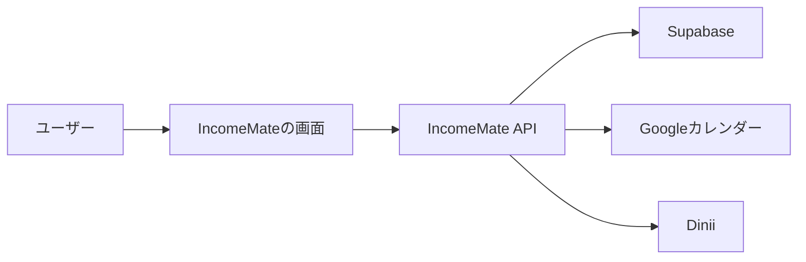

# IncomeMate

IncomeMateは、掛け持ちアルバイトの収入・シフト・勤務時間・扶養上限をまとめて管理する個人用アプリです。

## 背景

複数のアルバイトを掛け持ちしていると、勤務先ごとに時給、支払方法、交通費、残業や深夜勤務の扱いが異なります。さらに、タイミーのように案件ごとに金額が変わる働き方や、手渡しの収入もあるため、単純な家計簿だけでは管理しにくくなります。

IncomeMateは、そうした複雑な収入情報を「予定」「実績」「扶養上限」の視点から整理するために作っています。

## 主な機能

- 月ごとのアルバイト先別収入の管理
- 振込と手渡しの区別
- 扶養上限まであといくら稼げるかの表示
- Googleカレンダーの緑色予定をアルバイト予定として扱う設計
- Diniiなどのシフトサービス連携を想定した取り込みAPI
- タイミー案件履歴の記録
- PWAとしてスマホのホーム画面に追加できる枠組み
- Supabaseによるクラウド保存の準備

## アプリの仕組み



画面から直接外部サービスに触るのではなく、IncomeMateのAPIを通してデータを保存・取得します。これにより、秘密キーをブラウザやスマホに出さずに済みます。

## 技術構成

| 分類 | 使用技術 |
|---|---|
| 画面 | React / Next.js / Vinext |
| スタイル | CSS / Tailwind CSS |
| ローカル保存 | localStorage |
| クラウド保存 | Supabase |
| スマホ対応 | PWA |
| 外部連携 | Google Calendar / Dinii API routes |

## ドキュメント

| ドキュメント | 内容 |
|---|---|
| [docs/concept.md](docs/concept.md) | アプリの背景・目的 |
| [docs/app-flow.md](docs/app-flow.md) | PC・スマホ・API・Supabaseの流れ |
| [docs/setup.md](docs/setup.md) | PCセットアップ手順 |
| [docs/api.md](docs/api.md) | APIの役割と一覧 |
| [docs/security.md](docs/security.md) | 秘密情報とセキュリティ方針 |
| [docs/smartphone.md](docs/smartphone.md) | スマホで使う方法 |
| [docs/roadmap.md](docs/roadmap.md) | 今後の開発予定 |
| [docs/incomemate-setup-guide.md](docs/incomemate-setup-guide.md) | 初心者向けセットアップメモ |

## ローカルで動かす

```bash
pnpm install
pnpm run dev
```

起動後、ブラウザで以下を開きます。

```text
http://localhost:3000/
```

## Supabase設定

1. Supabaseでプロジェクトを作成
2. `supabase-schema.sql` をSQL Editorで実行
3. `.env.example` を参考に `.env` を作成
4. `SUPABASE_URL` と `SUPABASE_SERVICE_ROLE_KEY` を設定
5. 開発サーバーを再起動

`.env` はGitHubにアップしないでください。

## セキュリティ方針

- `SUPABASE_SERVICE_ROLE_KEY` はブラウザに出さない
- `.env` はGitHubへアップしない
- 銀行や外部シフトサービスのパスワードはコードに保存しない
- 収入・勤務先・カレンダー情報は個人情報として扱う

## 開発ステータス

現在はローカルで動くプロトタイプです。スマホPWA化とSupabase保存の土台は実装済みで、次にSupabase実設定とPC/スマホ同期確認を行います。
