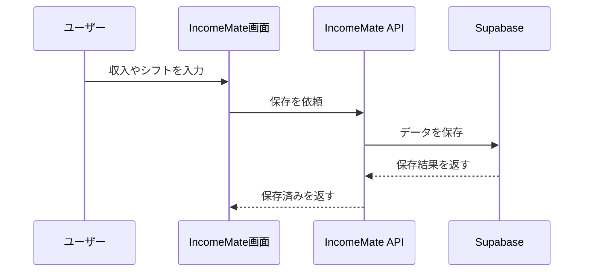

# APIの役割

APIは、IncomeMateの画面と外部サービスをつなぐ受付窓口です。

たとえば、画面で収入を入力したとき、画面が直接Supabaseに保存するのではなく、APIに「保存して」と依頼します。

## なぜAPIを使うのか

| 理由 | 説明 |
|---|---|
| 秘密キーを守る | Supabaseの強い鍵をブラウザに出さない |
| 処理をまとめる | 保存や同期のルールを一か所に置ける |
| 変更に強くする | 保存先が変わっても画面側を大きく変えなくて済む |
| 外部連携しやすい | GoogleカレンダーやDiniiとの接続をまとめられる |

## IncomeMateのAPI

| API | 役割 |
|---|---|
| `/api/supabase-snapshot` | Supabaseへ保存・読込 |
| `/api/calendar-sync` | Googleカレンダー予定の取り込み |
| `/api/dinii-sync` | Diniiシフト情報の取り込み |
| `/api/local-login` | ローカル確認用ログイン |
| `/api/local-logout` | ローカル確認用ログアウト |
