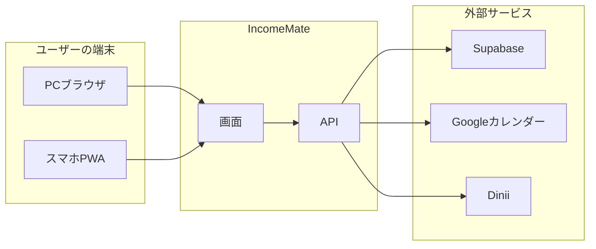
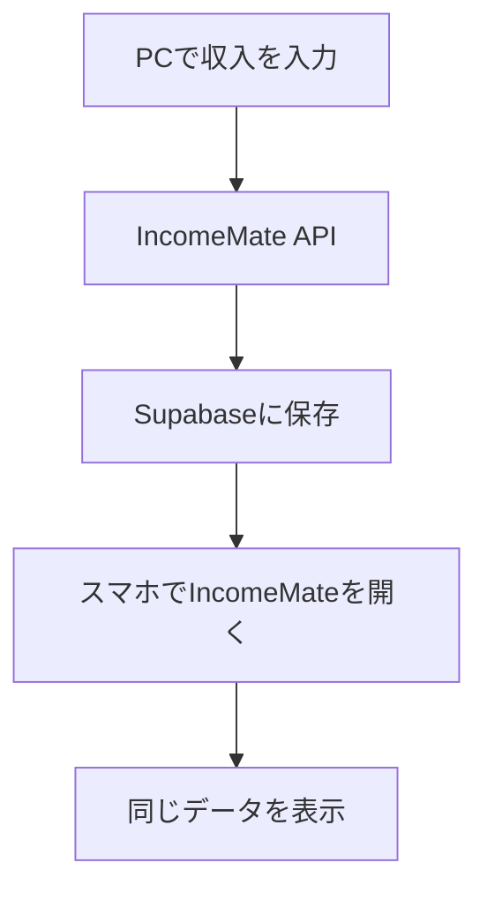

# IncomeMateの仕組み

IncomeMateは、画面・API・クラウド保存・外部連携で構成されています。

```mermaid
flowchart LR
  subgraph Device["ユーザーの端末"]
    PC["PCブラウザ"]
    Phone["スマホPWA"]
  end

  subgraph App["IncomeMate"]
    UI["画面"]
    API["API"]
  end

  subgraph External["外部サービス"]
    Supabase["Supabase"]
    Calendar["Googleカレンダー"]
    Dinii["Dinii"]
  end

  PC --> UI
  Phone --> UI
  UI --> API
  API --> Supabase
  API --> Calendar
  API --> Dinii
```

## PCとスマホの関係

PCとスマホは、どちらも同じIncomeMateを開きます。保存先をSupabaseにすることで、PCで入力した内容をスマホでも見られるようになります。

```mermaid
flowchart TD
  A["PCで収入を入力"] --> B["IncomeMate API"]
  B --> C["Supabaseに保存"]
  C --> D["スマホでIncomeMateを開く"]
  D --> E["同じデータを表示"]
```
