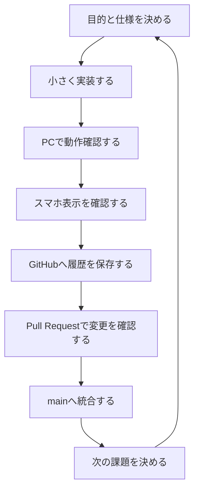

# IncomeMate 開発ガイド

Last updated: 18.Aug.2026

この資料は、「今何をしているのか」「なぜ必要なのか」「次に何を確認するのか」を後から振り返るための手順書です。

## 1. IncomeMateを作る目的

IncomeMateは、掛け持ちアルバイトの収入・シフト・勤務時間・支払方法を一か所で管理する個人用アプリです。

特に、勤務先ごとの時給、手渡しと振込、タイミー案件、深夜・残業、扶養上限の確認が別々になりやすい問題を解決します。

## 2. 開発の基本サイクル



各作業では、先に「変更するファイル」「目的」「確認方法」を決めます。動作確認が終わるまで、正式版の`main`へ直接変更を入れません。

## 3. 作業場所の役割

| 場所 | 役割 |
|---|---|
| VS Code | コード・資料を編集する |
| PowerShell | 開発サーバー、テスト、Gitを操作する |
| ブラウザ | IncomeMateの動作を見る |
| GitHub | 履歴、Pull Request、説明資料を保存する |
| Supabase | クラウドデータベースと認証を管理する |
| スマートフォン | 実際の画面サイズとPWAを確認する |

## 4. GitHubの安全な保存手順

```text
1. mainの最新状態を取得
2. 作業用ブランチを作成
3. 変更を小さく行う
4. build / testを実行
5. 対象ファイルだけをcommit
6. ブランチをpush
7. Pull Requestで差分を確認
8. 問題がなければmainへmerge
```

### 変更前の確認

- 未保存の変更がないか確認する
- `.env`が対象に含まれていないことを確認する
- 何を変更するかを作業ログに書く

### バージョンの考え方

IncomeMateは開発中なので、現在は`v0.1.0-dev`相当です。

| 表記 | 使う場面 |
|---|---|
| `v0.1.0-dev` | 開発中の最初の土台 |
| `v0.2.0` | 新しい機能を追加した版 |
| `v0.2.1` | 小さな修正や不具合修正版 |
| `v1.0.0` | 基本機能を正式公開できる版 |

## 5. Supabaseを使うときの確認順

1. SQL Editorで必要なテーブルを確認する
2. `.env`の変数名だけを確認する（値は表示しない）
3. IncomeMateを再起動する
4. 読み込みテストをする
5. テスト専用データを保存する
6. 再読み込みしてデータを取得する
7. エラーがあれば、ステータスと原因だけを記録する

`SUPABASE_SERVICE_ROLE_KEY`はサーバー側だけで使用します。スマホの画面、ブラウザのJavaScript、GitHub、チャット、スクリーンショットには出しません。

## 6. 公開までの段階

```text
ローカル確認
  ↓
PWAとしてスマホ確認
  ↓
少人数テスト
  ↓
iPhone: TestFlight / Android: Play Consoleテスト
  ↓
ストア審査
  ↓
正式公開
```

TestFlightやGoogle Playテストへ進む前に、ログイン、データ分離、削除方法、プライバシー説明を整えます。

## 7. 作業ログに残す内容

各作業日のログには、次の項目を残します。

- 日付
- バージョンまたは作業ブランチ
- 目的
- 実行したこと
- 確認したこと
- 発生したエラーと原因
- 次回の作業

## 8. 完了条件

機能を「完了」とする前に、最低限次を確認します。

- PCで表示できる
- スマホ幅でも操作できる
- 保存と読み込みができる
- ログアウト後に別ユーザーのデータが見えない
- 秘密情報が画面やGitHubに出ていない
- 作業内容がGitHubの資料に記録されている

## 9. IncomeMateの現在地

GitHubへの保存と`main`への統合は完了しています。次はSupabaseの接続・保存テスト、その後にPWAとしてのスマートフォン確認へ進みます。現在のタスクは[Tasks](tasks.md)と[Progress](progress.md)で管理します。
