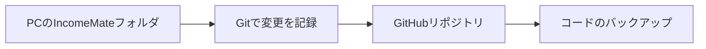
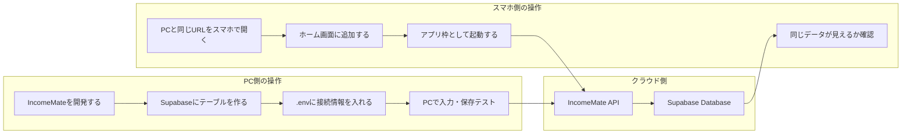
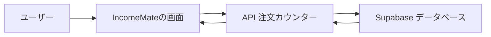
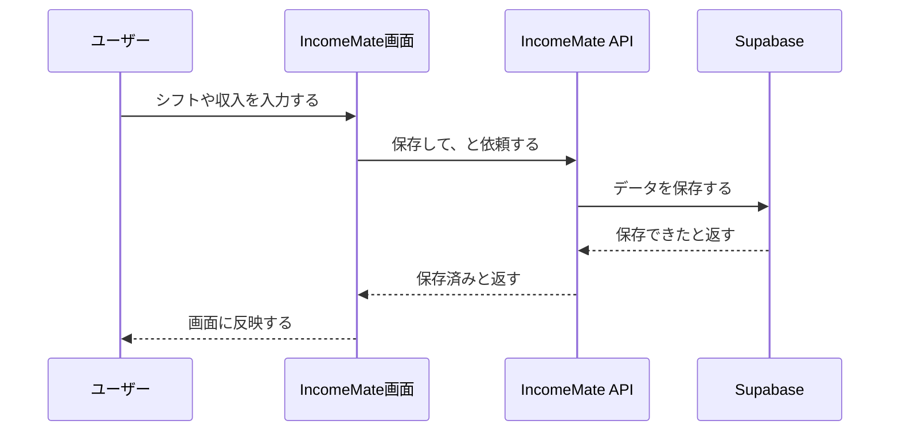
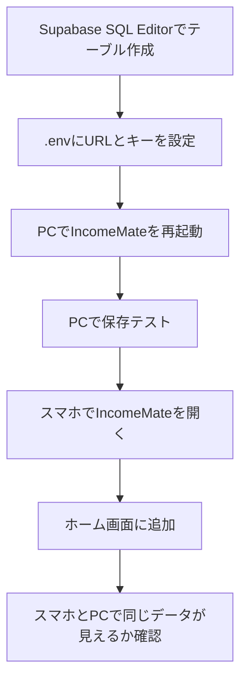

# IncomeMate セットアップ・操作マニュアル

IncomeMate は、アルバイトの予定・勤務時間・収入・扶養上限を管理するアプリです。
このメモは、PCでの開発作業とスマートフォンでの利用確認を並行して進めるための手順書です。

## 今日のタスク

| タスク | 状態 | メモ |
|---|---|---|
| GitHubとの連携 | 完了 | Supabase側のGitHub接続は完了済み |
| アプリ名変更 | 完了 | 今後は `IncomeMate` として扱う |
| スマホにアプリ枠組みを表示 | 準備済み | PWA設定でホーム画面追加に対応 |
| PCでのセットアップ | 進行中 | SupabaseのSQL作成と `.env` 設定が次 |
| APIの理解 | この文書で整理 | 「画面」と「保存先」の間にある入口 |

## GitHub連携の整理

GitHub連携には、似ているけれど別々の作業が2つあります。

| 種類 | 何をするか | 今の状態 |
|---|---|---|
| SupabaseとGitHubの連携 | SupabaseがGitHubリポジトリを参照できるようにする | 完了 |
| PCの作業フォルダとGitHubの連携 | このPCのIncomeMateコードをGitHubへ保存・更新できるようにする | 次に確認 |

PC側の連携が完了すると、次のような流れでバックアップできます。



## PCとスマホの並行フロー



## スマートフォンにアプリ枠組みとして入れる方法

IncomeMateはPWAとして設定されています。PWAは、Webサイトをスマホのホーム画面に追加して、アプリのように開ける仕組みです。

### iPhoneの場合

1. SafariでIncomeMateを開く
2. 共有ボタンを押す
3. 「ホーム画面に追加」を押す
4. 名前が `IncomeMate` になっていることを確認
5. 追加する

### Androidの場合

1. ChromeでIncomeMateを開く
2. 右上メニューを開く
3. 「アプリをインストール」または「ホーム画面に追加」を押す
4. 名前が `IncomeMate` になっていることを確認
5. 追加する

## PCでのセットアップ

次に必要なのはSupabaseの保存先を作ることです。

1. Supabaseの `SQL Editor` を開く
2. `supabase-schema.sql` のSQLを貼る
3. `Run` する
4. SupabaseのProject SettingsでURLとservice role keyを確認する
5. `.env` に入れる
6. 開発サーバーを再起動する
7. IncomeMateで保存テストする

`.env` に入れる内容は次の形です。

```env
SUPABASE_URL=自分のSupabase URL
SUPABASE_SERVICE_ROLE_KEY=自分のservice_role key
```

`SUPABASE_SERVICE_ROLE_KEY` はチャットやGitHubに貼らないでください。

## APIとは何か

APIは、アプリの画面と外部サービスをつなぐ「受付窓口」です。

たとえるなら、レストランの注文カウンターです。



ユーザーはSupabaseに直接触りません。
IncomeMateの画面で入力すると、APIが内容を受け取り、Supabaseへ保存します。

## IncomeMateで使うAPI

| API | 役割 |
|---|---|
| `/api/supabase-snapshot` | IncomeMateのデータをSupabaseに保存・読込する |
| `/api/calendar-sync` | Googleカレンダーの緑色予定を取り込む |
| `/api/dinii-sync` | Diniiのシフト情報を取り込む |
| `/api/local-login` | ローカル確認用ログイン |
| `/api/local-logout` | ローカル確認用ログアウト |

## APIを使う流れ



## なぜAPIを挟むのか

| 理由 | 説明 |
|---|---|
| 秘密キーを守るため | Supabaseの強い鍵をスマホやブラウザに出さない |
| 保存ルールをまとめるため | どのデータをどう保存するかを一か所で管理できる |
| 外部連携しやすくするため | GoogleカレンダーやDiniiとのやりとりもAPIにまとめられる |
| 将来の変更に強くするため | 保存先を変えても画面側への影響を小さくできる |

## 次にやること


