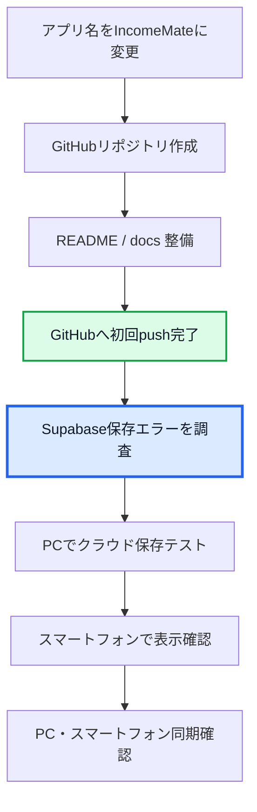

# IncomeMate Progress

Last updated: 12.Aug.2026

IncomeMateの開発進捗を管理するページです。

## 現在のフェーズ

GitHubへの初回pushと既存履歴の統合が完了しました。現在は、Supabase保存エラーを解消して、PCとスマートフォンで同じデータを使えるようにする段階です。

## 完了した主な作業

- IncomeMateのローカル起動
- GitHubリポジトリとの接続
- ローカルコード一式のコミット
- GitHub側の既存履歴との安全な統合
- `main`ブランチへのpush
- `.env`をGitHubの保存対象から除外

## 次にやること

1. Supabase保存エラーの原因を確認する
2. `incomemate_snapshots`テーブルと環境変数の名前を確認する
3. PCからクラウド保存できるかテストする
4. スマートフォンから同じデータを確認する
