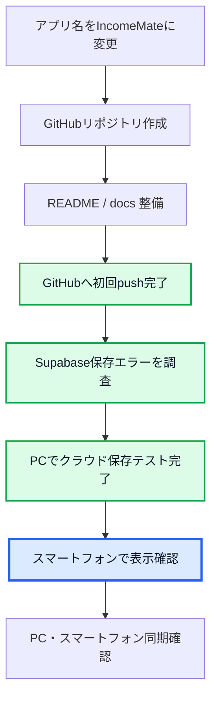

# IncomeMate Progress

Last updated: 18.Aug.2026

IncomeMateの開発進捗を管理するページです。

## 現在のフェーズ

GitHubへの初回pushと既存履歴の統合、SupabaseのPC保存テストが完了しました。現在は、スマートフォンから同じデータを確認する段階です。

## 完了した主な作業

- IncomeMateのローカル起動
- GitHubリポジトリとの接続
- ローカルコード一式のコミット
- GitHub側の既存履歴との安全な統合
- `main`ブランチへのpush
- `.env`をGitHubの保存対象から除外
- Supabase URLの形式を修正（`/rest/v1`を除外）
- Supabaseの読み込み・保存・再読み込みを確認
- PC画面からの一時保存テストと値の復元を確認

## 次にやること

1. スマートフォンでIncomeMateを開く
2. ホーム画面に追加する
3. PCとスマートフォンで同じデータを確認する
4. Supabase AuthとRLSによるユーザーごとのデータ分離を設計する
