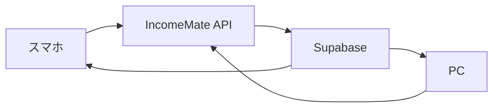

# スマホでIncomeMateを使う

IncomeMateはPWAとしてスマホのホーム画面に追加できます。

PWAは、Webサイトをアプリのように開ける仕組みです。App StoreやGoogle Playに出す前でも、アプリの枠組みとして使えます。

## iPhone

1. SafariでIncomeMateを開く
2. 共有ボタンを押す
3. 「ホーム画面に追加」を押す
4. 名前が `IncomeMate` になっていることを確認
5. 追加する

## Android

1. ChromeでIncomeMateを開く
2. 右上メニューを開く
3. 「アプリをインストール」または「ホーム画面に追加」を押す
4. 名前が `IncomeMate` になっていることを確認
5. 追加する

## スマホ同期の仕組み

スマホ本体だけに保存するのではなく、Supabaseに保存することでPCとスマホで同じデータを見られます。
